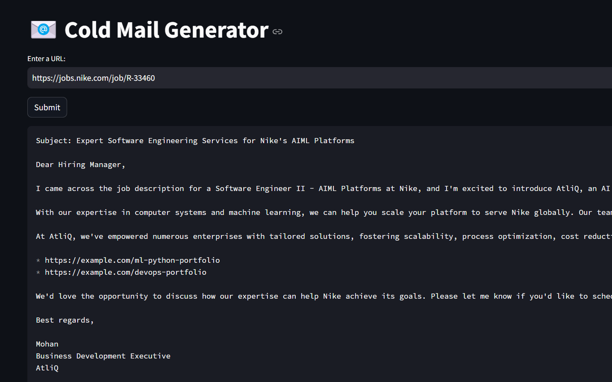

# 📧 GenAI Cold Email Generator

An end-to-end **LLM-powered** application that automates the process of writing personalized cold emails. By providing a job posting URL, the system scrapes the requirements, matches them against your specific portfolio using a **Vector Database (RAG)**, and drafts a professional email tailored to the role.

---

## 🔗 Live Demo
* **Live App:** [View Demo on Streamlit Cloud](https://your-app-link.streamlit.app) *(Replace with your link)*

---

## 🏗️ System Architecture

The project follows the **Retrieval-Augmented Generation (RAG)** framework to ensure the AI uses your real-world experience from a portfolio to generate high-quality content.


1.  **Scraper (`utils.py`)**: Fetches HTML and uses BeautifulSoup to isolate the job description, removing headers, footers, and scripts.
2.  **Extractor (`extractor.py`)**: Sends the text to **Llama 3.3 (Groq)** to convert unstructured text into a structured JSON (Role, Skills, Experience).
3.  **Vector Store (`portfolio.py`)**: Loads your project history from a CSV and stores them in **ChromaDB**. It uses semantic search to find the top projects matching the extracted skills.
4.  **Email Generator (`email_generator.py`)**: Combines the job info, portfolio links, and a selected strategy (Skills, Value, or Culture) to produce the final output.

---

## 🛠️ Tech Stack

| Category | Technology |
| :--- | :--- |
| **Language** | Python 3.10+ |
| **Frontend** | Streamlit |
| **LLM Provider** | Groq Cloud (Llama 3.3 70B Versatile) |
| **Framework** | LangChain |
| **Vector DB** | ChromaDB |
| **Data Tools** | Pandas, BeautifulSoup4, Requests |

---


## Architecture Diagram


## 📂 Project Structure

```text
├── app/
│   ├── resources/
│   │   └── my_portfolio.csv     # Your projects, tech stacks, and links
├── vectorstore/                 # Persistent ChromaDB database files
├── main.py                      # Streamlit UI & Orchestration
├── extractor.py                 # LLM logic for job parsing
├── email_generator.py           # LLM logic for email drafting
├── portfolio.py                 # Vector DB management (RAG)
├── utils.py                     # Web scraping & text cleaning
├── prompts.py                   # System & Strategy prompt templates
├── requirements.txt             # Project dependencies
└── .env                         # API Keys (not tracked by git)

```

## Set-up
1. To get started we first need to get an API_KEY from here: https://console.groq.com/keys. Create a .env file update the value of `GROQ_API_KEY` with the API_KEY you created. 


2. To get started, first install the dependencies using:
    ```commandline
     pip install -r requirements.txt
    ```
   
3. Run the streamlit app:
   ```commandline
   streamlit run app/main.py
   ```